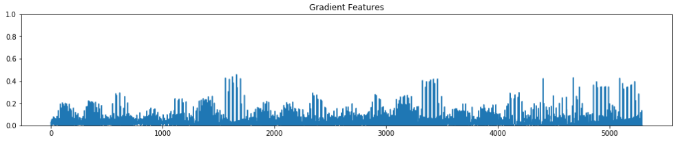
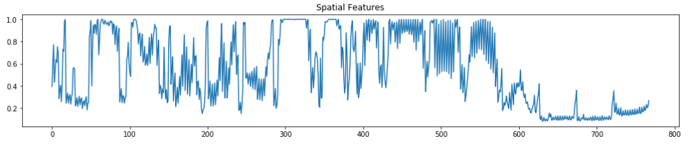

# Vehicle Detection Project

The goal of this project is to detect cars in a video feed and draw bounding boxes around them.

We do this by:

* Defining a feature extractor. We use a Histogram of Oriented Gradients (HOG) feature extractor, a color feature extractor, and a spatial feature extractor. 
* Train a classifier on our labeled training set of images of cars and non-cars.
* Search windows in images for cars using the trained classifier.
* Run on a video stream and create a heat map of recurring detections frame by frame to reject outliers and follow detected vehicles.
* Draw a bounding box around vehicles detected.

---

### 1. Feature Extraction

The first task is to define a feature extractor. This can be seen in the second code cell in the notebook.

I first grab example `vehicle` and `non-vehicle` images:


My feature extractor consists of three parts:

- **Histogram of Oriented Gradients (HOG) features**
- **Color features**
- **Spatial features**

To get the HOG feature vector, I use skimage's `hog()` function. After some experimentation, the parameters I ended up using are: 

```
orient = 9                    # HOG orientations
pix_per_cell = 8              # HOG pixels per cell
cell_per_block = 2            # HOG cells per block
hog_channel = 'ALL'           # 0, 1, 2, "GRAY" or "ALL"
```

The gradient feature vector run on the above vehicle image ends up looking like this:



To get the color features, I take a histogram of each color channel, with bin size 32, and concatenate these together into one vector. The color feature histograms look like this:


To get the spatial features, I use shrink the image down to 32x32 pixels and use `ravel()` to put the values into a vector. The spatial features look like this:



And so the full feature vector extracted looks like the following. I run it through `StandardScaler` to normalize the features:


The feature vector ends up having 8,460 features.

### 2. Train the classifier

Next, I train the classifier over the 17,760 vehicle and non-vehicle images, making sure to normalize them first. This can be seen in the fourth code cell in the notebook. I acheive 98.56% accuracy using a 20% randomly selected validation set.

### 3. Sliding Window Search

Next up I define a function so that I can give it an area in an image and window size parameters and it will return coordinates of windows. I pass it the area from 45% down the image, which is just above the horizon, because cars can't fly yet, all the way down to 80% down the image, where the hood of the car is covering the road. I use 64, 128, 256, 512 pixel sqaure windows, as shown all overlapped here:


For each frame of the video, I run the classifer over each of the windows defined by the function, and see if a car is detected in that window.


### 4. Heatmapping

The classifier is not perfect, and often predicts false positives. So in order to work around this, I define a global `heat` variable that remains remembered frame by frame over the video. When the classifer finds a car in a window, I add the value of 1 to all the pixels in that window area in the `heat` image. I then threshold the heat image by 2, so that only places in the image where the classifer detected a car in the same area more than twice is shown.


### 5. Bounding boxes

After getting the heatmap, I use SciPy's `label()` to find where the bounding boxes are for the detections, by running it over the `heat` image. I draw these boxes over the original image like thus:


### 6. Video Implementation

After running the pipeline one frame at a time over the video, I end up with bounding boxes drawn on each frame where cars were detected. 

Here's [my video result](./project_video.mp4).

### 7. Discussion

The end video quickly finds the white car and draws a bounding box over it. The position of the bounding box is not exactly around where the car is though.

And the black car seems to be very difficult for the detector to detect.

There are a number of false positives that remain detected over multiple frames of the videos, such as up in the trees and the road dividers.

This could be improved by improving the classifier and tuning the feature extractor.
